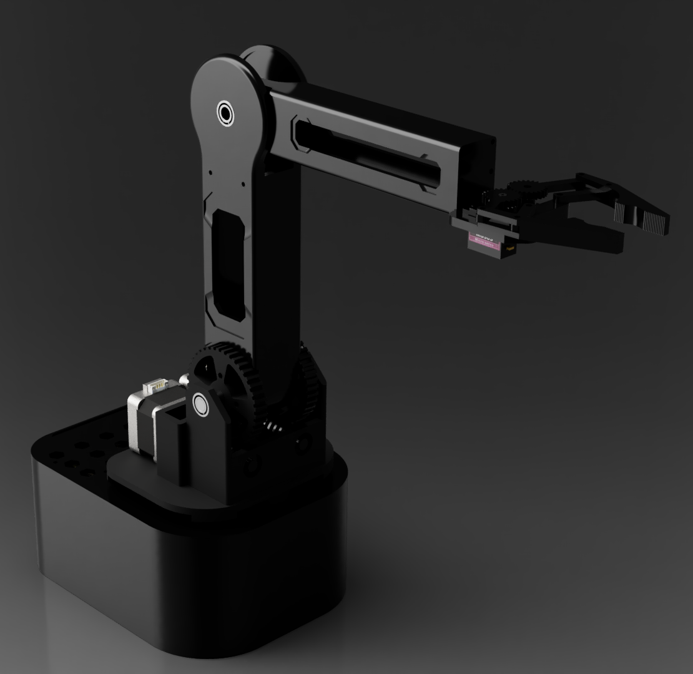

# Voice-Controlled Robotic Arm 🦾

## Project Overview

This project involves designing and constructing a robotic arm controlled via voice commands, utilizing Amazon Alexa for voice recognition. It explores key areas in robotics, including mechanical arm construction, voice control systems, and integration with various electronic components for seamless functionality. The goal is to create an intuitive robotic interface that allows users to interact naturally with the robot through simple commands.


## Table of Contents
- [Project Overview](#project-overview)
- [Project Objectives](#project-objectives)
- [Features](#features)
- [Technologies Used](#technologies-used)
- [System Architecture](#system-architecture)
- [Setup Instructions](#setup-instructions)
- [Usage](#usage)
- [Acknowledgments](#acknowledgments)

## Features

- **Voice Control**: The robotic arm can be controlled with voice commands, powered by Amazon Alexa.
- **Digital Control System**: Includes a custom PCB with an Arduino Nano and motor drivers to control stepper motors for precise movement.
- **Vision System**: Integrates a Microsoft Kinect camera for object detection and environmental awareness.
- **3D-Printed Components**: Many mechanical parts are 3D-printed, providing flexibility and accessibility in design.

## Technologies Used

- **Mechanical Design**: Autodesk Fusion 360, 3D Printing (PLA filament)
- **Electronics**: Arduino Nano, Raspberry Pi, TMC2130 Motor Drivers, Mean Well EDR-120-12 Power Supply
- **Programming Languages**: Python (for Raspberry Pi), C++ (for Arduino Nano)
- **Voice Assistant**: Amazon Alexa and AWS Lambda for command processing
- **Communication Protocols**: MQTT for communication between Raspberry Pi and Alexa's cloud services

## System Architecture

The system architecture consists of:
- **Voice Control Module**: Amazon Alexa interprets commands and communicates with the Raspberry Pi via AWS Lambda and MQTT.
- **Electronic Control Module**: A Raspberry Pi processes commands and interfaces with the Arduino Nano to control motors and the camera.
- **Mechanical Control Module**: Includes stepper motors and servo-based grippers for precise control of the robotic arm.

## Setup Instructions

### Project structure

```
.
├── 3D printed parts/   # 3D models for printed parts
├── code/               # Main application code
└── PCB/                # PCB design files
```

1. **Hardware Assembly**:
   - Assemble 3D-printed and off-the-shelf components, following the assembly guide.
   - Connect motors, camera, and power supply to the Raspberry Pi and Arduino Nano.
   
2. **Software Installation**:
   - Install the required Python libraries on Raspberry Pi for voice processing and motor control.
   - Set up the Arduino Nano with the control code for managing motor functions.
   - Configure the Alexa Skill with AWS Lambda function and enable MQTT for command messaging.

3. **Voice Command Setup**:
   - Configure the Alexa Skill for the robotic arm using the Alexa Skills Kit (ASK).
   - Link Alexa to the AWS IoT Core via MQTT for seamless communication.

## Usage

After setup, activate the Alexa skill with the command phrase `"Wake up, samurai"`, and use the following commands to control the robotic arm:
- **"Open the gripper"** or **"Close the gripper"**
- **"Move [direction] [distance]"** (e.g., "Move forward 5 centimeters")
- **"Rotate [direction] [angle]"** (e.g., "Rotate left 30 degrees")
- **"Pick it up"** - Grasp an object using the gripper
- **"Stop moving"** - Stop all movements


## Acknowledgments

This project was developed as part of an Engineering Thesis at Gdańsk University of Technology. All rights are reserved by the university.

Please note that the code and associated files for this project have not been updated and may be in an incomplete or outdated state. This project was initially developed four years ago, at a time when I had limited experience with the technologies and concepts involved. As a result, the structure and implementation may not reflect best practices or current standards. While the project serves as a foundation, it is recommended to consider it as a learning artifact rather than a fully polished, production-ready solution.